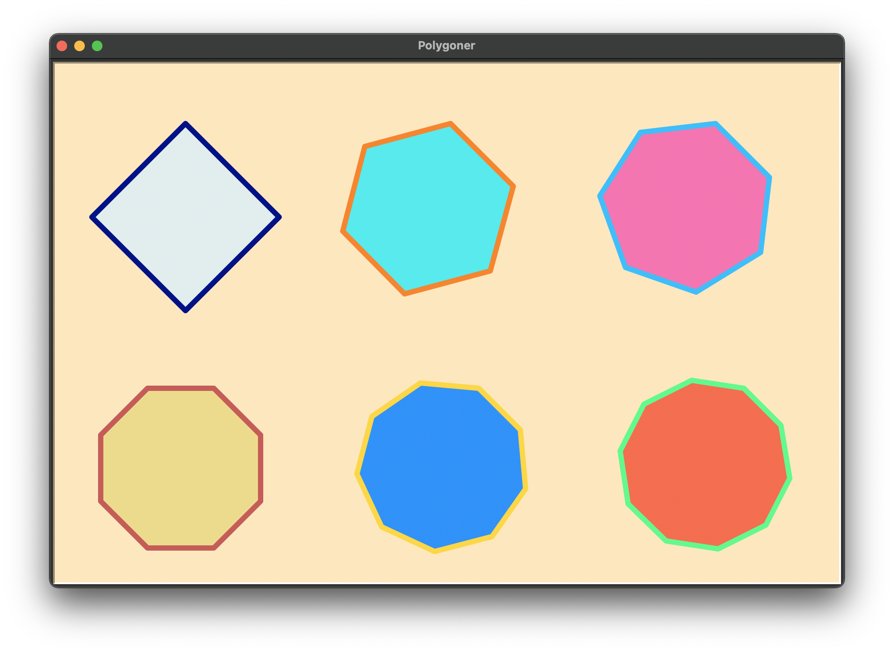

# Övning 1 - Polygoner
Python-biblioteket [turtle](https://docs.python.org/3/library/turtle.html) kan
användas för att rita bilder av olika slag. I den här uppgiften ska du rita
regelbundna polygoner (i en regelbunden polygon är alla sidor lika långa och
alla vinkar lika stora), så att resultatet blir ungefär som följande bild.

Till din hjälp har du [start-filen](polygoner.py) , där det visas hur en
färglagd kvadrat kan ritas.

Experimentera med denna fil för att bekanta dig med de olika parametrarna.
Därefter så så försöker du dig på att rita en liknande bild som ovan.

(Om du inte kan installera Python lokalt på din dator så finns en motsvarande
[startfil här](https://replit.com/@nikodemus/TurtleShapeIntro#main.py) i en
online-miljö).
